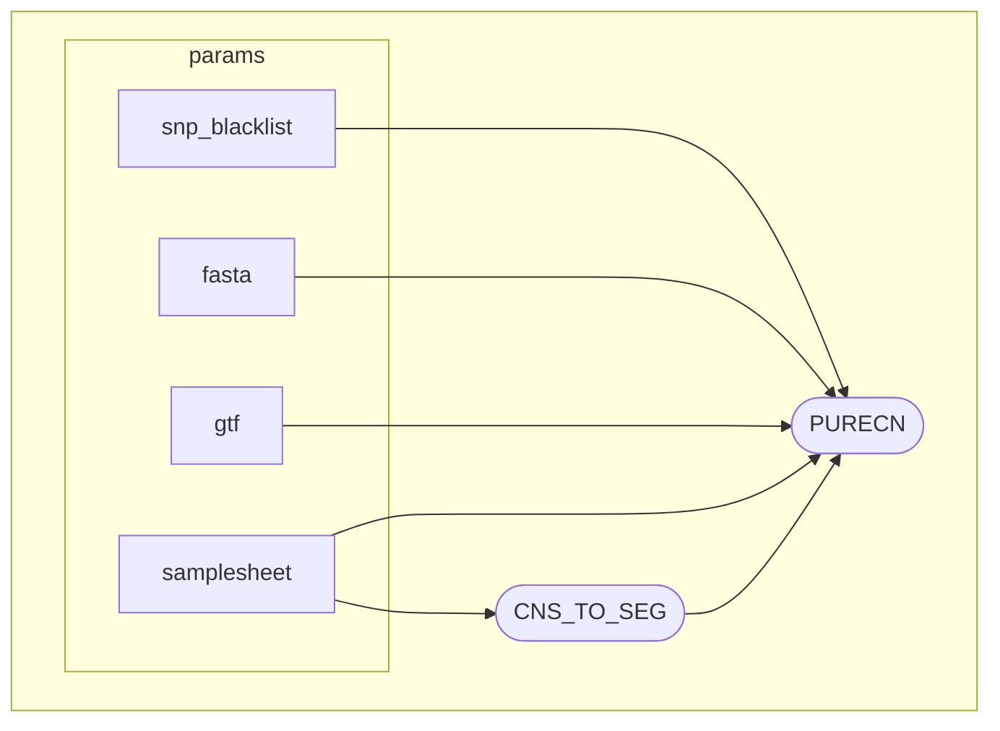

# PureCN Nextflow Pipeline

[](https://www.nextflow.io/)
[](https://www.docker.com/)
[](https://sylabs.io/docs/)

A Nextflow pipeline for running [PureCN](https://github.com/lima1/PureCN) on tumor-normal paired samples using outputs from [nf-core/sarek](https://github.com/nf-core/sarek) (Mutect2 + CNVKit) to generate clonality estimates of somatic variants.

## Overview

This pipeline processes CNVKit copy number ratio (`.cnr`) and segment (`.cns`) files along with somatic variant calls (VCF) to:
- Convert CNS files to SEG format compatible with PureCN
- Estimate tumor purity and ploidy
- Calculate clonality of somatic variants
- Identify copy number alterations with their clonal status

### Pipeline Workflow



## Quick Start

### Prerequisites

- [Nextflow](https://www.nextflow.io/) (≥25.04)
- [Docker](https://www.docker.com/) or [Singularity](https://sylabs.io/singularity/)
- Input files from nf-core/sarek (Mutect2 + CNVKit analysis)
- Reference genome files (FASTA, GTF) - hg38 recommended
- SNP blacklist BED file (e.g., ENCODE hg38 blacklist)

### Installation

The pipeline can be run directly from GitHub without installation:

```bash
nextflow run tylergross97/nextflow_purecn \
  --samplesheet samplesheet.csv \
  --snp_blacklist hg38_encode_blacklist.bed \
  --fasta hg38.fa \
  --gtf hg38.gtf \
  --outdir_base results \
  -profile docker
```

Or clone the repository for local development:

```bash
git clone https://github.com/tylergross97/nextflow_purecn.git
cd nextflow_purecn
nextflow run main.nf -profile test,docker
```

## Usage

### Basic Command

```bash
nextflow run tylergross97/nextflow_purecn \
  --samplesheet /path/to/samplesheet.csv \
  --snp_blacklist /path/to/hg38_encode_blacklist.bed \
  --fasta /path/to/hg38.fa \
  --gtf /path/to/hg38.gtf \
  --outdir_base /path/to/results \
  -profile docker
```

### Required Parameters

| Parameter | Description |
|-----------|-------------|
| `--samplesheet` | CSV file containing sample information (see format below) |
| `--snp_blacklist` | BED file of SNP blacklist regions (e.g., ENCODE hg38 blacklist) |
| `--fasta` | Reference genome FASTA file (hg38 primary assembly) |
| `--gtf` | Gene annotation GTF file (hg38 primary assembly) |
| `--outdir_base` | Base directory for output files (default: `results`) |

### Samplesheet Format

Create a CSV file with the following columns:

```csv
sample_id,tumor_cnr,tumor_cns,vcf
sample1_tumor_vs_normal,/path/to/sample1.cnr,/path/to/sample1.cns,/path/to/sample1.vcf.gz
sample2_tumor_vs_normal,/path/to/sample2.cnr,/path/to/sample2.cns,/path/to/sample2.vcf.gz
sample3_tumor_vs_normal,/path/to/sample3.cnr,/path/to/sample3.cns,/path/to/sample3.vcf.gz
```

**Column Descriptions:**
- `sample_id`: Unique identifier for the tumor-normal pair
- `tumor_cnr`: Path to CNVKit copy number ratio file (`.cnr`)
- `tumor_cns`: Path to CNVKit copy number segment file (`.cns`)
- `vcf`: Path to filtered somatic variants VCF file (`.vcf.gz`)

### Profiles

The pipeline supports multiple execution profiles:

| Profile | Description |
|---------|-------------|
| `docker` | Run with Docker containers (recommended) |
| `singularity` | Run with Singularity containers |
| `test` | Run with minimal test dataset (use with `docker` or `singularity`) |

**Examples:**

```bash
# Run with Docker
nextflow run tylergross97/nextflow_purecn -profile docker [other parameters]

# Run with Singularity
nextflow run tylergross97/nextflow_purecn -profile singularity [other parameters]

# Run test dataset with Docker
nextflow run tylergross97/nextflow_purecn -profile test,docker

# Run test dataset with Singularity
nextflow run tylergross97/nextflow_purecn -profile test,singularity
```

## Output

The pipeline generates the following output structure:

```
results/
├── purecn/
│   ├── <sample_id>/
│   │   ├── <sample_id>.csv           # PureCN results summary
│   │   ├── <sample_id>.rds           # R data object
│   │   ├── <sample_id>_amplification_pvalues.csv
│   │   ├── <sample_id>_chromosomes.pdf
│   │   ├── <sample_id>_local_optima.pdf
│   │   └── ...
└── references/
    └── <sample_id>.seg               # Converted SEG files
```

### Key Output Files

- **`<sample_id>.csv`**: Main results table with purity, ploidy, and variant clonality
- **`<sample_id>_chromosomes.pdf`**: Visualization of copy number alterations across chromosomes
- **`<sample_id>_local_optima.pdf`**: Purity/ploidy solution quality plots
- **`<sample_id>.seg`**: SEG format file converted from CNS

## Testing

Test the pipeline with included test data:

```bash
nextflow run tylergross97/nextflow_purecn -profile test,docker
```

This runs the pipeline on synthetic/minimal test data with predefined parameters.

## Resource Requirements

Typical resource usage per sample:
- **CPU**: 2-4 cores
- **Memory**: 8-16 GB RAM
- **Runtime**: 15-30 minutes per sample
- **Storage**: ~500 MB per sample (varies with data size)

## Troubleshooting

### Common Issues

**1. Missing required parameters**
```
Error: Missing required parameters: --samplesheet, --fasta
```
**Solution**: Ensure all required parameters are provided on the command line.

**2. File not found errors**
```
Error: Samplesheet file not found: samplesheet.csv
```
**Solution**: Check that file paths in parameters and samplesheet are correct and accessible.

**3. Container runtime errors**
```
Error: Cannot find Docker/Singularity
```
**Solution**: Ensure Docker or Singularity is installed and accessible. Use `-profile docker` or `-profile singularity`.

## Citations

### Pipeline

If you use this pipeline in your work, please cite:

> Gross, T. (2025). PureCN Nextflow Pipeline (Version 1.0.1) [Computer Software]. https://github.com/tylergross97/nextflow_purecn

### Tools

This pipeline uses the following tools that should be cited independently:

**Nextflow:**
> Di Tommaso, P., Chatzou, M., Floden, E. W., Barja, P. P., Palumbo, E., & Notredame, C. (2017). Nextflow enables reproducible computational workflows. *Nature Biotechnology*, 35(4), 316-319. https://doi.org/10.1038/nbt.3820

**PureCN:**
> Riester, M., Singh, A. P., Brannon, A. R., Yu, K., Campbell, C. D., Chiang, D. Y., & Morrissey, M. P. (2016). PureCN: copy number calling and SNV classification using targeted short read sequencing. *Source Code for Biology and Medicine*, 11(1), 13. https://doi.org/10.1186/s13029-016-0060-z

**CNVKit:**
> Talevich, E., Shain, A. H., Botton, T., & Bastian, B. C. (2016). CNVkit: Genome-Wide Copy Number Detection and Visualization from Targeted DNA Sequencing. *PLOS Computational Biology*, 12(4), e1004873. https://doi.org/10.1371/journal.pcbi.1004873

**nf-core/sarek:**
> Ewels, P. A., Peltzer, A., Fillinger, S., et al. (2020). The nf-core framework for community-curated bioinformatics pipelines. *Nature Biotechnology*, 38, 276-278. https://doi.org/10.1038/s41587-020-0439-x

## Contributing

Contributions are welcome! Please feel free to submit issues or pull requests to the [GitHub repository](https://github.com/tylergross97/nextflow_purecn).

## License

This pipeline is distributed under the MIT License. See the `LICENSE` file for details.

## Contact

For questions or support, please open an issue on the [GitHub repository](https://github.com/tylergross97/nextflow_purecn/issues).

## Acknowledgments

- Thanks to the PureCN developers for creating this powerful tool
- Thanks to the nf-core community for the sarek pipeline
- Thanks to the Nextflow team for the amazing workflow framework